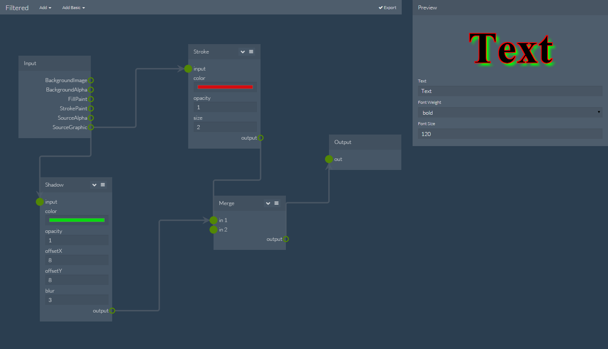

# Filtered
Simple Svg Filter builder

### Browser Support
- Chrome 31+
- FireFox 38+
- Safari 7.1+
- Internet Exporer 10+
- Opera 30+

### To-Do
 - Add [SpecularLighting](http://www.w3.org/TR/SVG/filters.html#feSpecularLightingElement) Effect
 - Add [DiffuseLighting](http://www.w3.org/TR/SVG/filters.html#feDiffuseLightingElement) Effect
 - Add [ComponentTransfer](http://www.w3.org/TR/SVG/filters.html#feComponentTransferElement) Effect
 - Add [Tile](http://www.w3.org/TR/SVG/filters.html#feTileElement) Effect
 - Add [Image](http://www.w3.org/TR/SVG/filters.html#feImageElement) Effect
 - Improve position editor, allow for "PX" and "EM" not just "%"
 - Add panning to editor, right now it just has zoom
 - Add a function for loading filters in the form of xml

### Contributing
Try to keep your code clean.
other then that, contribution is more then welcome.