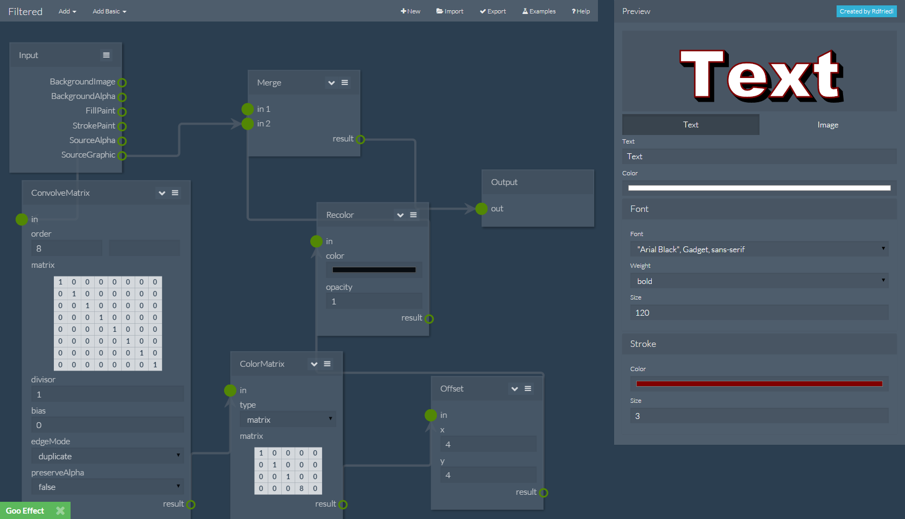

# Filtered
Simple Svg Filter builder

### Browser Support
- Chrome 31+
- FireFox 38+
- Safari 7.1+
- Internet Exporer 10+
- Opera 30+

### To-Do
 - Add [Tile](http://www.w3.org/TR/SVG/filters.html#feTileElement) Effect
 - Improve position editor, allow for "PX" and "EM" not just "%"
 - Improve ComponentTransfer.render
 - Add panning to editor, right now it just has zoom
 - Add a function for loading filters in the form of xml
